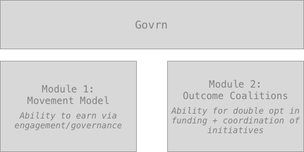
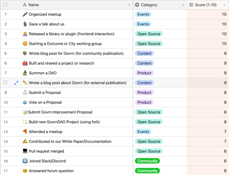
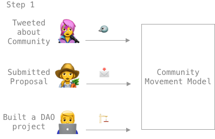
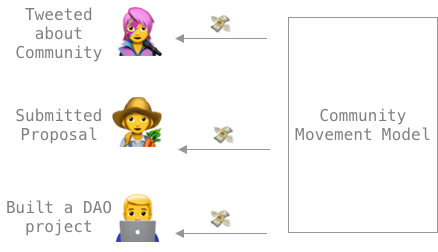
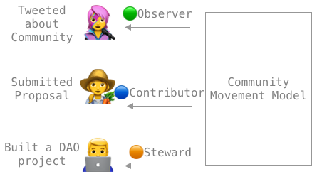
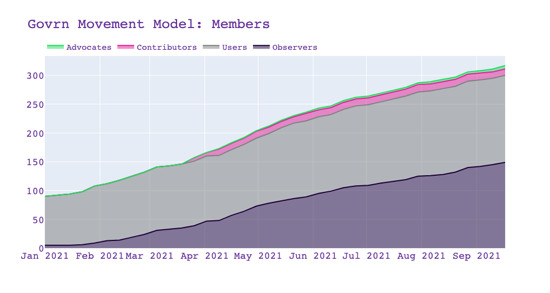
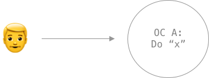
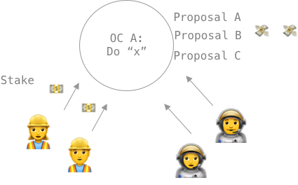
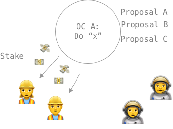
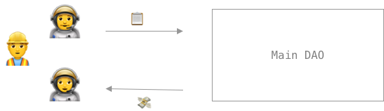

# The Govrn Governance Model

At Govrn, we believe that **anything that governs you, you should be able to govern. **

We’ve spent the last few years refining our governance model to help achieve this goal, learning from, contributing to, and building on what others have done. We’ve gotten to the point where our governance model has evolved into a much broader framework than we originally had envisioned, and we want to introduce it.

We believe that this is an evolving and live framework. By putting it out, we can start to find where the gaps are and what the strengths are.

We focus on four guiding principles:

- Proof of Engagement
- Proof of Commitment
- Proof of Completion
- Composable Governance

This framework will help fix common problems in governance - both in DAOs as well as Politics. The key is to think of this model as a framework that enables individual communities to “plug and play” governance legos towards their specific context.

To follow along with a visual diagram, see [here](https://www.figma.com/file/RXrVG6UBNTrsJ7uwqPAcY0/Govrn-Governance-Model-Diagram?node-id=0%3A1).

**Special Mention**

We want to specifically call out the ability to fork or ragequit as a governance mechanism. Much of our model is built around the idea of community coordinators. At some points, it might seem as though the system is permissioned.

We think governance should be free and open, but we aren’t obtuse to the fact that even in “flat” organizations, leaders still exist. The Govrn framework builds around the idea that “engagement is governance”, and that all engagement exists outside the context of any one community.

This makes community governance extremely fluid and “forkable.” It means that if a “community coordinator” is abusing the power, you don’t just have the ability to fork the “monetary liquidity”, you have the ability able to fork all the “engagement liquidity” you’ve contributed. The engagements operate on their own, with communities applying their own framework on it. In theory, you could have the same set of engagements yielding two different communities.

We make engagements a property of the community member, not the community. This is important as it enables community coordinators with power but keeps the real power locked with the community members.

**You own your own contributions.**

**You own your own governance.**

And if a community coordinator ever abuses that, the community members can start a new community at ease.

## The Govrn Governance Model

The Gorvn governance model operates as two modules:

- Module 1: The Movement Model
- Module 2: Outcome Coalitions

Each serves a different purpose.

1. **The Movement Model** creates a framework for community contributions focused on operational priorities. The Model allows community members to contribute and earn rewards/governance for those contributions.
2. **Outcome Coalitions** give a community ways to scale up or scale down initiatives they wish to accomplish. By allowing you to vote or fund Outcome Coalitions with the “rewards” you earn in the Movement Model, it’s the Outcome Coalitions that make the “rewards” valuable.

While each module can work on its own, the interplay between the modules increases the value created for the community. One is focused on supporting ongoing operations and the other enables members to coordinate towards shared goals. The points you earn via the Movement Model can be used (e.g. vote or fund) on the Outcome Coalitions and increase your relative governance power within the community.

Let us dive deeper into each module.

## The Movement Model

The Movement Model is a framework that allows communities to define a set of operational tasks, and assign point values to each task. As community members complete a task, the member is rewarded with its associated point value. The individual can utilize their points by participating in governance, funding projects/outcome coalitions, or just holding.

To ensure the framework stays current and appropriately rewards contributions based on the needs of the community, the engagement &lt;> points mapping should be reconfirmed via a community vote each month (time period can be set by each community).

We track all the contributions of members, distribute the points, and assign an associated role based on the points accrued. The steps are as follows:

**Step 1:** Members report weekly engagements

Each week, the members will report and submit their engagements for the previous week. Each engagement is an atomic transaction and can exist within and outside the context of a specific community.

**Step 2:** Movement Model calculates and distributes reward

At the end of the week, the community leaders approve the new intake of engagements, and the Movement Model rewards the contributors with points. To help remove bottlenecks, we’re able to automate feeds as well as leverage self-reporting tools based on public verification. In the future, we hope to decentralize this process as we bring more of this data on-chain.

**Step 3:** Distribute roles and levels

Additionally, to help organize the community, the movement model organizes members into roles based on the members’ current point totals. These roles or tiers are voted on and enforced by the community.

This creates an open and permissionless system to recognize leaders with experiential knowledge while allowing anyone to rise up to leadership roles.

This allows the DAO to track the type of contributions and total value created.

By creating a base set of clear ways to contribute and how much a member will “earn” for their contribution, this model creates an open onboarding process for members. Further, it also enables a permissionless way for anyone to become a leader of a DAO or community. A community member can rise through the ranks simply by contributing to the community rather than playing a popularity contest.

This forward-looking approach should be combined with a retroactive/bottom-up award system such as SourceCred or Coordinape.

We believe that engagement is governance. When you contribute to documentation, you’re participating in governance. When you’re tweeting about your community, you’re participating in governance.

We use the concept of **Proof of Engagement** to capture the engagement and reward you with governance power.

## Outcome Coalitions

Outcome Coalitions are a way for community members to create sub-communities to align and accomplish specific goals. If you’re familiar with our original [Outcome-Based Donations](https://medium.com/govrn/an-intro-to-outcome-based-donations-8ebb800f6fbd), these are closely related.

To exemplify how this might be different than the current state, let’s imagine a DAO expert who is the People Operations Expert wanting to start an onboarding workstream.

- Current State: The People Operation Expert would put together a proposal, request the budget on certain guidelines, have the DAO vote on the proposal, then when passed the People Operation Expert would work to find the DAO members with the required knowledge, willing to join the workstream, within the guidelines already voted on by the DAO.
- Future State (with Govrn): The People Operation Expert would propose an Outcome Coalition, she would garner support from Builders and Funders using a double opt-in process around the goal, and once the team had agreed on how the project can be executed, she could then request funds to reimburse the team for the Outcome Coalition.

While similar steps, the current state puts the cart before the horse, while Outcome Coalitions can be flexible and ask for funding once the team is built and understands how to accomplish the goals.

We’ve seen that there are two main types of stakeholders from whom buy-in is needed to accomplish goals: Builders and Funders.

- **Builders:** Builders have the knowledge, tools, and viewpoint to be able to execute on community decisions and deliverables towards a community goal.
- **Funders: **Funders are members of a community and believe a certain goal would be beneficial for the community, but they might not have the skill set needed. As funders, they can use their unique perspective to influence governance by funding the initiatives they believe in.

We’ve designed Outcome Coalitions to allow both builders and funders to coordinate around an outcome or initiative. We then use a double opt-in process to create a check and balance between both the stakeholders.

- Builders have to “opt-in” to building the outcome

- Funders have to “opt-in” funding an OC, and voting on a specific proposal

Below is the framework we believe enables this:

**Step 1: **Create a Coalition

Bob creates an Outcome Coalition X. This is essentially proposing a new idea and can be done by a community member(s).

- An example of this might be “Create additional educational content on our DAO to help with the onboarding of new members”

**Step 2: **Stake and Spend on a Coalition

Projects require two types of support to be successful, builders and funders.

This is represented in two ways:

- Builders stake their value points on an OC. This represents a commitment to working on the project.
- Funders donate their funds to the project, showing that they’re willing to fund the project. When a funder funds a project, they receive a corresponding amount of voting tokens to vote on a specific proposal (more on proposals later).
  - Funders can donate either value points earned in the movement model or normal tokens. Ultimately it’s up to what the builders are willing to accept as credible funding.

**Step 3: **Spenders vote on the Completion Proposal

In order to determine if an OC’s goal is reached and ensure all participants are aligned on how to accomplish the goal, completion criteria proposals are submitted to the OC.

Completion Criteria can be proposed by anyone. They should contain the details on the mechanism used to determine if a goal was achieved, and how the funding will be distributed at the end.

Funders receive votes proportional to their contributions and vote on their preferred proposal. Like all else, the calculation of “proportional votes” is composable and can be customized for the specific needs of the OC (e.g. votes can be distributed quadratically).

If they vote for a proposal that the builders don’t agree with, the builders can unstake their points/funds during the grace period.

This creates a double “opt-in” process for both builders and funders.

**Step 4: **Stakers receive Stake + Funding Bonus

Once a completion criteria proposal is met, the builders receive both the original stake, as well as payment from the funding raised by the funders.

If the goal is not achieved (aka completion criteria is not met), both the points staked from funders and builders go to the community treasury. That said, we know many unforeseen consequences occur that prevent goals from being achieved as originally intended. So we enable funders with the ability to vote to override and send the stake and the funding (the whole amount or proportion) to builders.

- We don’t recommend the funds being returned to the funders because it creates a zero-sum game incentive.
- Being able to have funds returned to funders give funders an incentive to work against the builders, as they’d (funders) receive their funding back.

The calculation on how much of the funding a builder receives can be customizable to the specific OC. It can be as simple as exactly proportional to the amount staked, a combination amount staked vs a retroactive grading of the OC, or anything in between. You could even layer on a Coordinape mechanism on the OC. This is what **Composable Governance** means.

This process creates a trustless environment via **Proof of Commitment** (from both builders and funders) and **Proof of Completion** (rewards only given upon successful completion).

**Step 5**: Submit for Community Reimbursement

At any point in the process, the OC members can submit a proposal to the main DAO to be reimbursed for funding. This allows the OCs both to operate autonomously, but also receive funding from the main DAO for providing value to the main DAO.

While it takes a lot to engage the full DAO, OCs create a flexible process for initiatives to move with agility and small consensus, while reducing exposure of the most active community members.

### Let’s Do It

We’re excited about testing this model out with DAOs and communities. We believe it provides a flexible framework that allows DAOs to:

1. Scale Up or Scale Down specific initiatives
2. Work more quickly compared to normal DAO Governance
3. **Enables the Community Members to own their governance**

This is the current snapshot of our governance model. We highly expect (and hope!) that it continues to change and improve. We’ve uploaded a version of this onto our Github Repo as well in hopes that others make modifications or suggestions to it. We want both positive feedback and negative feedback. The collection of all our heads is much better than just those that worked on this (although special thank you to Spencer Graham, Nichanan Kesonpat, and Nick Naraghi for your help and editing).

Have ideas? Come jump in our Discord and let us know. Have thoughts (both good and bad)? Share them on twitter so we can create the kind of public debate we want.

If you want to try out the Govrn Governance Model, come reach out to us so we can add you to the list of organizations waiting to use Govrn.
